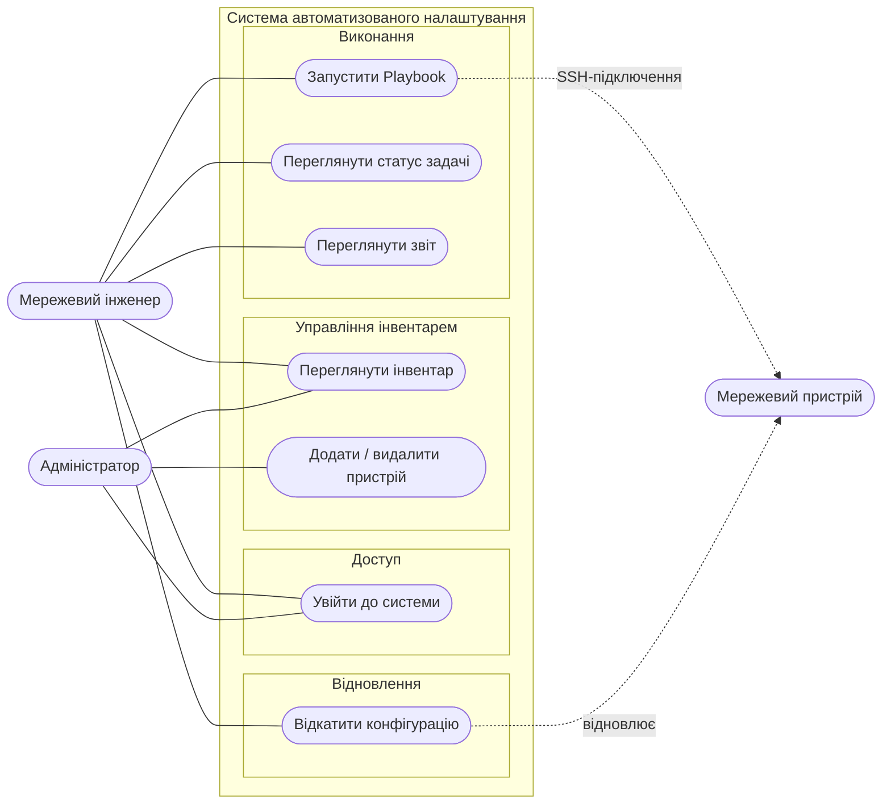
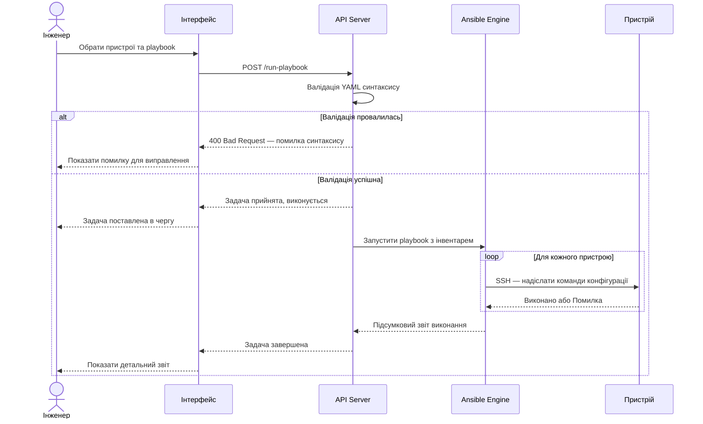
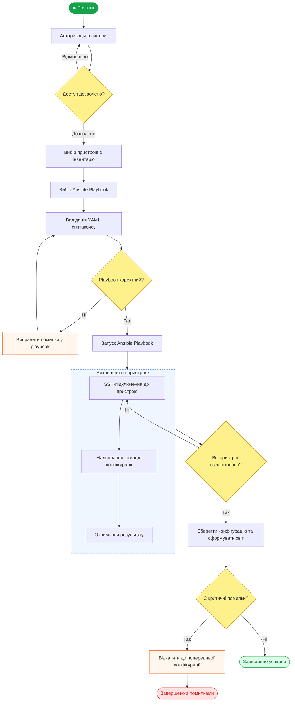

#  Лабораторна робота: Поведінкові UML-діаграми

**Дисципліна:** Проєктування інформаційних систем  
**Тема:** Побудова поведінкових UML-діаграм для проєктування ІС  
**Інструмент моделювання:** Mermaid.js  
**Предметна область:** Система автоматизованого налаштування мережевого обладнання

---

##  Мета роботи

Набути практичних навичок моделювання інформаційної системи за допомогою поведінкових UML-діаграм: навчитися аналізувати вимоги до системи та візуалізувати її структуру й поведінку.

---

##  Предметна область

Система автоматизованого налаштування мережевого обладнання дозволяє мережевим інженерам централізовано керувати конфігурацією маршрутизаторів і комутаторів через Ansible Playbook-и та Python API. Замість ручного підключення до кожного пристрою окремо — інженер запускає один сценарій, який автоматично підключається до всіх пристроїв через SSH і застосовує необхідні налаштування.

**Актори системи:**

| Актор | Роль |
|---|---|
|  Мережевий інженер | Запускає playbook-и, переглядає звіти, відкочує конфігурацію |
|  Адміністратор | Керує інвентарем пристроїв та користувачами системи |
|  Мережевий пристрій | Об'єкт налаштування (Cisco, MikroTik тощо) |

---

##  Діаграми

### 1. Use Case Diagram — Діаграма варіантів використання

---

### 2. Sequence Diagram — Діаграма послідовності

---

### 3. Activity Diagram — Діаграма діяльності

---

##  Зв'язок між діаграмами

| Діаграма | Відповідає на питання | Ключовий сценарій |
|---|---|---|
| **Use Case** | Хто? Що робить? | Актори та всі функції системи |
| **Sequence** | Як об'єкти взаємодіють? | Деталі запуску Playbook (UC4) |
| **Activity** | Який алгоритм кроків? | Повний процес від входу до звіту |

Усі три діаграми описують **один і той самий процес** — автоматизоване налаштування мережевого обладнання — але з різних точок зору: від загального (хто що робить) до конкретного (як саме і в якому порядку).

---

##  Висновок

У ході виконання лабораторної роботи обрано предметну область — систему автоматизованого налаштування мережевого обладнання на базі Ansible та Python. Побудовано три взаємопов'язані UML-діаграми: Use Case відображає функції системи та акторів, Sequence деталізує взаємодію компонентів при запуску playbook, Activity описує повний алгоритм процесу з розгалуженнями та обробкою помилок. Усі діаграми виконано у Mermaid.js та оформлено в Markdown.
